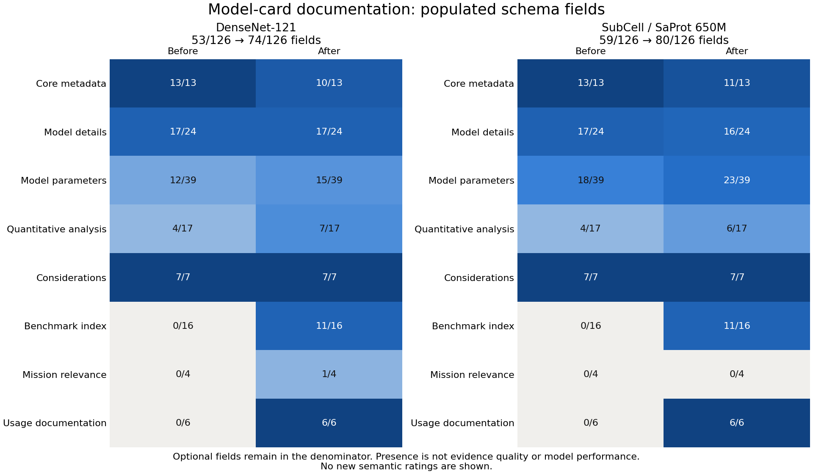

# Two-card remediation analysis

The [supplied heatmap](../../../../notes/model_card_remediation/baseline/README.md)
is preserved as the baseline. The comparison below uses the same 126 terminal schema
paths and the same deterministic evaluator source on both original and revised YAMLs.

| Measure | DenseNet before | DenseNet after | SubCell before | SubCell after |
|---|---:|---:|---:|---:|
| Populated schema paths | 53/126 (42.1%) | 74/126 (58.7%) | 59/126 (46.8%) | 80/126 (63.5%) |
| Hybrid rubric10 | 41/50 | 47/50 | 44/50 | 45/50 |
| Hybrid rubric20 | 58/84 | 67/84 | 63/84 | 62/84 |

**These hybrid scores are not the figure's semantic scores.** No fresh semantic/LLM
evaluation has been performed. The June 15 archived semantic totals remain 37/50 and
61/84 for DenseNet, 39/50 and 64/84 for SubCell, subject to the original hash limitations.
They describe the baseline cards only.

SubCell's hybrid rubric20 score decreased by one point after removing unsupported
framework and version-date assertions and adding structured usage. Accuracy of the
documentation takes priority over retaining points for unverified statements.

## Interpretation limits

- Presence includes optional fields and does not establish correctness, applicability
  or completeness. Some core fields were deliberately removed because they were
  unsupported or inappropriate for the documented task.
- New benchmark-index and usage fields improve structure, but do not constitute
  new model-performance measurements. Paper-level training/funding context is not
  a recovered checkpoint-run record.
- The existing hybrid rubric20 `train_eval_leakage` rule flags dataset-name overlap,
  including ordinary separate splits of the same ImageNet family. Its DenseNet cap
  is not proof of leakage. The independent SubCell string-overlap audit in the
  evidence ledger is a different, directly observed finding with explicit scope limits.
- The hybrid Q19 keyword rule still flags SubCell despite its new recommendation to
  compare aggregate accuracy with rare-compartment recall and macro-F1. This remains
  a heuristic limitation for semantic review; the rule was not changed to raise a score.
- Original-run compute, a tested training environment, prediction-level subgroup
  measurements and uncertainty remain unresolved. Documenting their absence does
  not supply those data.

Artifacts: [vector figure](field_presence_comparison.svg),
[all field paths](field_presence.csv), [comparison and hashes](comparison.json).
Individual deterministic evaluations are in `before/` and `after/`; each records
its YAML hash, evaluator source hash and schema hash.

Run `python scripts/analyze_model_card_remediation.py` from the repository root to
reproduce the comparison. See the [remediation ledger](../../../../notes/model_card_remediation/README.md)
for source evidence, issue drafts and remaining artifact requests.
