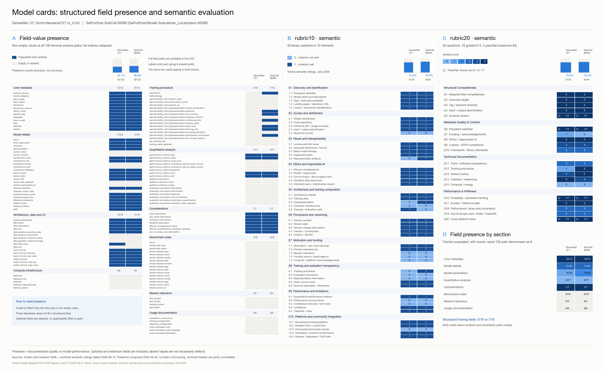

# Supplied heatmap baseline

These are immutable inputs to the September 28, 2026 remediation review. The PNG
and two CSVs are exact copies of the supplied `model-card-heatmaps` assets. The
two YAML snapshots are retrieved from the figure's recorded source commit,
`c0d94d239d6b302d4b2fbb8ebd3bc9f5ebbf1e90`, and match its recorded SHA-256 hashes.

The compact `provenance.json` retains input hashes, counting rules and limitations
from the supplied provenance file. It records the original provenance file's
hash without duplicating all archived evaluation evidence, which remains in
`data/evaluation/hf_hub/{rubric10_semantic,rubric20_semantic}/`.

| Measure | DenseNet-121 | SubCell / SaProt 650M |
|---|---:|---:|
| Populated terminal paths | 53/126 | 59/126 |
| Archived semantic rubric10 | 37/50 | 39/50 |
| Archived semantic rubric20 | 61/84 | 64/84 |

The semantic evaluations date to June 15, 2026. DenseNet rubric20 has a placeholder
card hash, and SubCell rubric10 records `n/a`; those two bindings cannot be
verified from the archived metadata. Their hashes have not been repaired or
reassigned to revised inputs.

Presence includes optional and potentially inapplicable fields. It is not an
applicability-adjusted completeness score or a measure of evidence quality.
In particular, absent DOE facilities, prompting templates, superseding versions,
graphics and custom terms for standard licenses do not automatically imply
documentation defects.

